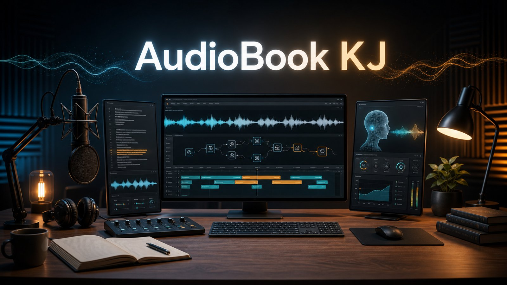
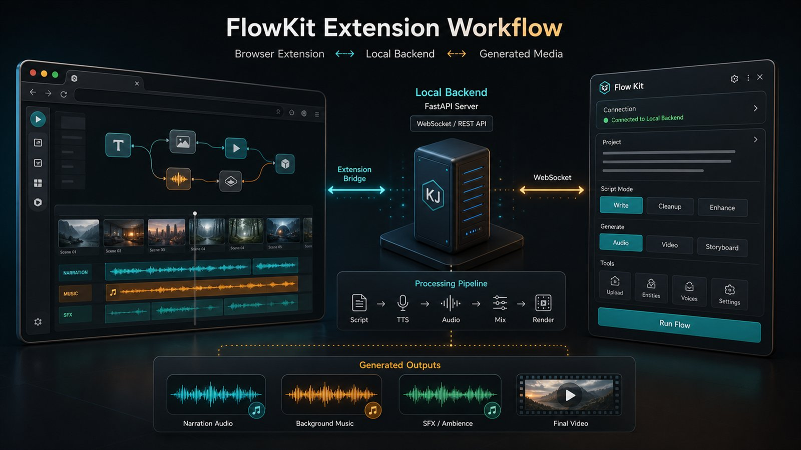
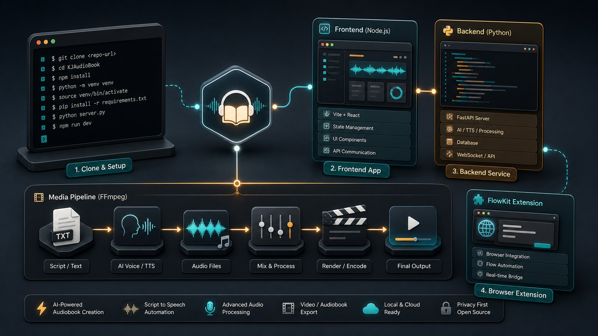

# AudioBook KJ

<a id="top"></a>

[English](#english) | [Tiếng Việt](#tieng-viet) | [Prerequisites](#prerequisites) | [Gemini CLI](#gemini-cli-setup) | [Chrome Extension](#chrome-flowkit-extension-setup) | [AI Agent Prompt](#ai-agent-setup-prompt)

<a id="english"></a>



Source-only public snapshot for reference, experimentation, and learning.

This repository intentionally excludes generated media, local databases, virtual environments, node modules, private voice references, planning notes, and manuscript/reference content. The code may need local adjustment before it runs on another machine.

## One-Click Start For Windows

For non-technical users on Windows:

1. Download this repo as a ZIP or clone it.
2. Extract the ZIP.
3. Double-click:

```text
run.bat
```

The launcher will check for Git, Node.js, npm, Python, and FFmpeg. If something is missing, it will offer to install it with `winget`. Then it installs frontend/backend dependencies, creates the Python virtual environment, starts the backend, starts the frontend, and opens the browser.

Notes:

- Keep the backend and frontend terminal windows open while using the app.
- Backend AI/TTS dependencies can be large and may take a long time to install.
- If `winget` installs a tool but the launcher still cannot find it, close the terminal and run `run.bat` again.
- Gemini CLI and the Chrome FlowKit extension are still optional and described below.

## What Is This?

AudioBook KJ is an experimental AI audiobook/video studio. The goal is to explore a workflow where long-form text can be cleaned, structured, converted into narrated audio, arranged on a media timeline, connected with generated visual assets, and exported as an audiobook/video project.

This is not a polished production app. It is a public source snapshot for people who want to study the architecture, borrow ideas, or see how a React frontend, Python backend, AI helpers, audio processing, and a Chrome extension can be wired together.

## App Workflows

The project is built around these rough workflows:

1. **Script import and cleanup**

   Bring text/script content into the app, clean markdown, split long content into chunks, and optionally call Gemini CLI helper flows to rewrite, enhance, or normalize script sections.

2. **AI direction and metadata**

   Extract useful entities, character references, scene hints, and storyboard-like metadata. These helpers are experimental and may require Gemini CLI.

3. **Text-to-speech generation**

   Convert script lines into audio clips using the Python backend and local TTS/model tooling. Private voice reference files are intentionally not included in this public repo.

4. **Audio timeline and mixing**

   Arrange narration, music, and sound effect clips; mix audio with Python tools such as pydub; use FFmpeg where export or media rendering requires it.

5. **Video/visual asset workflow**

   Manage generated or imported visual assets and connect them to scenes/timeline clips. Generated images and videos are excluded from the public repo.

6. **FlowKit browser bridge**

   The local Chrome extension can bridge browser-based Google Flow workflows with the local backend. This part is experimental and should be reviewed carefully before use.

7. **Export**

   Combine audio/video assets into final outputs. Exported media is ignored by Git to keep the repo small and clean.

In short: the repo is a playground for building an AI-assisted audiobook/video production pipeline, not a ready-to-sell product.

## Prerequisites

Install these before trying to run the app:

- **Git**: required to clone the repository.
- **Node.js 20.19+ or 22.12+**: required by the Vite/React frontend.
- **npm**: included with Node.js; used inside `frontend/`.
- **Python 3.10 or 3.11**: recommended for the backend and AI/audio dependencies.
- **FFmpeg**: required for audio/video mixing and export features.
- **Google Chrome or Chromium**: required if using the bundled FlowKit browser extension.
- **Gemini CLI**: optional, but required for script/storyboard helper flows that call `gemini`.
- **CUDA-capable GPU + NVIDIA drivers**: optional, but strongly recommended for local TTS/model generation with Torch/OmniVoice.

Useful Windows install examples:

```powershell
winget install Git.Git
winget install OpenJS.NodeJS.LTS
winget install Python.Python.3.11
winget install Gyan.FFmpeg
winget install Google.Chrome
```

After installing, open a new terminal and verify:

```powershell
git --version
node --version
npm --version
python --version
ffmpeg -version
```

Optional Gemini CLI setup depends on your local AI tooling/account. If `gemini --version` fails, skip Gemini-related features or ask an AI agent to help install/configure it.

## Hardware Requirements

AudioBook KJ is a local-first AI media workflow, not a lightweight note-taking app. Local TTS/model features use Torch, Transformers, Hugging Face model caches, and OmniVoice, so first launch and first generation can take a while.

Minimum:

- **OS**: Windows 10/11 64-bit.
- **RAM**: 8 GB.
- **Storage**: 10-15 GB free space.
- **CPU**: Recent Intel i5 / Ryzen 5 or equivalent.
- **GPU**: Not required for the public source workflow, but CPU generation will be slower.
- **Internet**: Required during setup and for first-time model/dependency downloads.

Recommended:

- **OS**: Windows 11 64-bit.
- **RAM**: 16-32 GB.
- **Storage**: 20-30 GB free space on SSD/NVMe.
- **CPU**: Intel i7 / Ryzen 7 or better.
- **GPU**: NVIDIA GPU with 6-8 GB+ VRAM if you plan to experiment with GPU/CUDA model generation.

If the app appears to hang on first launch, it may be installing dependencies, loading model weights, or warming up the local AI/TTS engine. On low-memory machines, close other heavy apps before running generation/export jobs.

## Gemini CLI Setup

Some backend helper flows call the `gemini` command directly, especially script cleanup, prompt enhancement, entity extraction, and storyboard generation helpers. Install Gemini CLI only if you want to use those features.

Official install options:

```powershell
npm install -g @google/gemini-cli
```

Or run without a global install:

```powershell
npx https://github.com/google-gemini/gemini-cli
```

Verify the command is available:

```powershell
gemini --version
```

First-run setup:

```powershell
gemini
```

Then follow the login/auth prompts from Gemini CLI. If your terminal cannot find `gemini`, close and reopen the terminal, then check:

```powershell
npm config get prefix
npm bin -g
```

Make sure the global npm binary folder is on your `PATH`.

Notes:

- Use the official npm package name: `@google/gemini-cli`.
- Do not install similarly named unofficial packages.
- The code in this repo uses commands like `gemini --skip-trust`; review Gemini CLI permissions and trust prompts before letting it modify files.
- If Gemini CLI is not installed, the main frontend can still be inspected, but Gemini-powered helper endpoints may fail.

## Chrome FlowKit Extension Setup



The repo includes a local unpacked Chrome extension at:

```text
audiobook_builder/flowkit_extension
```

It is designed as a local bridge for Google Flow-related workflows. It expects the local backend to be running and may interact with:

- `https://labs.google/fx/tools/flow`
- `https://aisandbox-pa.googleapis.com`
- local backend WebSocket/API routes

Install it in Chrome:

1. Open Chrome.
2. Go to `chrome://extensions`.
3. Enable **Developer mode**.
4. Click **Load unpacked**.
5. Select the folder `audiobook_builder/flowkit_extension`.
6. Pin the **Flow Kit** extension if you want quick access.
7. Start the backend with `python server.py`.
8. Open `https://labs.google/fx/tools/flow` if you want to use Flow-related features.

If Chrome refuses to load it:

- Confirm `manifest.json` exists inside `audiobook_builder/flowkit_extension`.
- Reload the extension from `chrome://extensions`.
- Check the extension error panel for missing files or permission warnings.
- Make sure the backend is running on the expected local port before using bridge features.

Important:

- This extension is for local experimentation.
- It requests broad browser permissions because it bridges local tooling and Google Flow requests.
- Review `manifest.json`, `background.js`, and `side_panel.js` before using it with a personal Google account.
- Do not publish personal tokens, cookies, generated media, or local DB files.

## References

Use these links to understand the tools and libraries used in this project.

Core tooling:

- [Git documentation](https://git-scm.com/doc)
- [Node.js downloads](https://nodejs.org/en/download)
- [npm documentation](https://docs.npmjs.com/)
- [Python documentation](https://docs.python.org/3/)
- [FFmpeg documentation](https://www.ffmpeg.org/documentation.html)

Frontend:

- [React documentation](https://react.dev/)
- [Vite documentation](https://vite.dev/guide/)
- [Tailwind CSS documentation](https://tailwindcss.com/docs)
- [TanStack Query documentation](https://tanstack.com/query/latest/docs/framework/react/overview)
- [React Flow documentation](https://reactflow.dev/)
- [Axios documentation](https://axios-http.com/docs/intro)
- [Lucide React icons](https://lucide.dev/guide/packages/lucide-react)

Backend and API:

- [FastAPI documentation](https://fastapi.tiangolo.com/)
- [Uvicorn documentation](https://www.uvicorn.org/)
- [Python multipart package](https://github.com/Kludex/python-multipart)

AI and audio:

- [PyTorch documentation](https://docs.pytorch.org/docs/stable/index.html)
- [PyTorch install selector](https://pytorch.org/get-started/locally/)
- [Torchaudio documentation](https://docs.pytorch.org/audio/stable/index.html)
- [Hugging Face Transformers documentation](https://huggingface.co/docs/transformers/index)
- [Hugging Face Hub Python library](https://huggingface.co/docs/huggingface_hub/index)
- [python-soundfile documentation](https://python-soundfile.readthedocs.io/)
- [pydub GitHub repository](https://github.com/jiaaro/pydub)
- [OmniVoice GitHub repository](https://github.com/k2-fsa/OmniVoice)
- [OmniVoice model on Hugging Face](https://huggingface.co/k2-fsa/OmniVoice)

Gemini and browser extension:

- [Gemini CLI GitHub repository](https://github.com/google-gemini/gemini-cli)
- [Gemini CLI getting started docs](https://github.com/google-gemini/gemini-cli/blob/main/docs/get-started/index.md)
- [Chrome Extensions documentation](https://developer.chrome.com/docs/extensions)
- [Chrome Extensions getting started](https://developer.chrome.com/docs/extensions/mv3/getstarted)
- [Google Flow](https://labs.google/fx/tools/flow)

## Acknowledgements

- Thanks to [crisng95/flowkit](https://github.com/crisng95/flowkit) for the FlowKit extension idea/reference.

## Donate / Support

If this repo gives you ideas, saves you time, or helps you build your own AI media workflow, donations are welcome.

This repository is the **Version 2.1** snapshot, featuring the modularized React frontend (separate Audio/Video Studios), optimized database management, and refactored backend pipelines. Support helps me continue developing, adding more media engines, and documenting advanced AI workflows.


No pressure though. Starring the repo, sharing feedback, opening issues, or showing what you build from it also helps a lot.

## AI Agent Setup Prompt

Copy this prompt into any coding AI agent after cloning the repository:

```text
You are helping me set up and run this cloned project locally.

Goal:
- Inspect the repository structure first.
- Verify the required system software is installed before installing project dependencies.
- Identify the backend, frontend, package managers, runtime versions, and entry points.
- Install only the dependencies needed to run the source code.
- Recreate ignored/generated folders only when needed.
- Do not restore private assets, voice samples, generated audio/video, local databases, node_modules, virtual environments, or planning/manuscript files.
- Prefer safe local setup steps and explain any command before running it.

Repository context:
- This is a source-only public snapshot.
- Some assets and generated files were intentionally removed by .gitignore.
- The project is not guaranteed to run immediately after clone.

```text
You are helping me set up and run this cloned project locally.

Goal:
- Inspect the repository structure first.
- Verify the required system software is installed before installing project dependencies.
- Identify the backend, frontend, package managers, runtime versions, and entry points.
- Install only the dependencies needed to run the source code.
- Recreate ignored/generated folders only when needed.
- Do not restore private assets, voice samples, generated audio/video, local databases, node_modules, virtual environments, or planning/manuscript files.
- Prefer safe local setup steps and explain any command before running it.

Repository context:
- This is a source-only public snapshot.
- Some assets and generated files were intentionally removed by .gitignore.
- The project is not guaranteed to run immediately after clone.
- Treat missing media/output files as expected.
- Use placeholder environment variables for secrets/API keys.
- Frontend likely needs Node.js 20.19+ or 22.12+ because it uses a modern Vite stack.
- Backend likely needs Python 3.10/3.11, FFmpeg, FastAPI/Uvicorn, Torch, Transformers, Hugging Face tooling, pydub, soundfile, and OmniVoice.
- Gemini CLI and Chrome/Chromium are optional unless I want to use Gemini helper flows or the FlowKit extension.
- Gemini CLI can be installed with `npm install -g @google/gemini-cli`; verify with `gemini --version`.
- The Chrome extension can be loaded unpacked from `audiobook_builder/flowkit_extension` via `chrome://extensions`.
- On Windows, try `run.bat` first for one-click setup and launch.

Suggested workflow:
1. Check `git`, `node`, `npm`, `python`, and `ffmpeg` versions.
2. On Windows, inspect and consider using `run.bat` for one-click setup.
3. If Gemini features are requested, check `gemini --version`; otherwise mark Gemini as optional.
4. If FlowKit browser features are requested, explain how to load the Chrome extension from `audiobook_builder/flowkit_extension`.
5. Read README files, package files, requirements files, and obvious app entry points.
6. Check the frontend folder for package.json and install frontend dependencies.
7. Check the audiobook_builder folder for Python requirements and create a local virtual environment.
8. Look for .env usage and create a local .env.example or .env only with placeholders.
9. Start backend and frontend separately if applicable.
10. If startup fails because ignored assets or databases are missing, create minimal placeholders or explain what is missing.
11. Summarize the final setup commands and how to run the app.

Constraints:
- Do not commit secrets.
- Do not download large model/media files unless I explicitly approve.
- Do not add generated outputs to Git.
- Keep changes small and focused on local setup.

Please begin by listing the detected project structure and then propose the exact setup commands for my machine.
```

## Likely Local Setup



The project appears to contain:

- `frontend/`: Vite/React frontend.
- `audiobook_builder/`: Python backend and audiobook tooling.

Typical commands an AI agent may try after inspection:

```powershell
cd frontend
npm install
npm run dev
```

```powershell
cd audiobook_builder
python -m venv venv
.\venv\Scripts\Activate.ps1
pip install -r requirements.txt
pip install fastapi uvicorn python-multipart
python server.py
```

These commands are starting points only. Let the AI agent inspect the current machine and adjust them.

---

<a id="tieng-viet"></a>

# AudioBook KJ - Bản Tiếng Việt

[English](#english) | [Tiếng Việt](#tieng-viet) | [Phần Mềm Cần Cài](#phan-mem-can-cai-truoc) | [Cài Gemini CLI](#cai-gemini-cli) | [Cài Extension](#cai-chrome-extension-flowkit) | [Prompt AI Agent](#prompt-tieng-viet-cho-ai-agent) | [Lên đầu trang](#top)


Đây là bản source public để tham khảo ý tưởng, học hỏi và thử nghiệm.

Repo này cố tình không đưa lên các file media đã generate, database local, virtual environment, `node_modules`, voice reference riêng tư, ghi chú planning, manuscript và tài liệu tham khảo. Vì vậy app có thể cần chỉnh lại đôi chút trước khi chạy trên máy khác.

## Chạy Một Click Trên Windows

Dành cho người không rành kỹ thuật:

1. Download repo dạng ZIP hoặc clone repo.
2. Giải nén ZIP.
3. Double-click file:

```text
run.bat
```

Launcher này sẽ kiểm tra Git, Node.js, npm, Python và FFmpeg. Nếu thiếu phần nào, nó sẽ hỏi để cài bằng `winget`. Sau đó nó cài dependency frontend/backend, tạo Python virtual environment, start backend, start frontend và mở browser.

Lưu ý:

- Giữ hai cửa sổ terminal backend/frontend mở khi dùng app.
- Dependency AI/TTS của backend có thể khá nặng và cài lâu.
- Nếu `winget` cài xong nhưng launcher vẫn chưa nhận ra tool mới, hãy đóng terminal rồi chạy lại `run.bat`.
- Gemini CLI và Chrome FlowKit extension vẫn là optional, hướng dẫn nằm bên dưới.

## Đây Là App Gì?

AudioBook KJ là một project thử nghiệm dạng AI audiobook/video studio. Mục tiêu là thử workflow biến nội dung dài thành script sạch hơn, chia đoạn, tạo audio narration, quản lý timeline/media, kết nối với asset hình/video được generate, rồi export thành một project audiobook/video.

Đây không phải app production hoàn chỉnh. Repo này public chủ yếu để anh em tham khảo kiến trúc, lấy ý tưởng workflow, hoặc xem cách nối React frontend, Python backend, AI helper, audio processing và Chrome extension lại với nhau.

## Các Workflow Chính Của App

Project xoay quanh các workflow sau:

1. **Import và dọn script**

   Đưa text/script vào app, clean markdown, chia nội dung dài thành chunk, và có thể gọi Gemini CLI để rewrite, enhance hoặc chuẩn hóa từng đoạn script.

2. **AI direction và metadata**

   Trích xuất entity, character reference, scene hint và metadata kiểu storyboard. Các helper này còn thử nghiệm và có thể cần Gemini CLI.

3. **Tạo giọng đọc / text-to-speech**

   Chuyển từng dòng script thành audio clip bằng backend Python và tooling TTS/model local. Các file voice reference riêng tư không được đưa vào repo public.

4. **Timeline audio và mixing**

   Sắp xếp narration, music, sound effect; mix audio bằng Python/pydub; dùng FFmpeg khi cần export hoặc render media.

5. **Workflow hình/video asset**

   Quản lý asset hình/video được import hoặc generate, rồi gắn chúng với scene/timeline clip. Media đã generate được ignore để repo nhẹ.

6. **FlowKit browser bridge**

   Chrome extension local có thể bridge workflow Google Flow trên browser với backend local. Phần này còn thử nghiệm, nên đọc kỹ code extension trước khi dùng.

7. **Export**

   Ghép audio/video asset thành output cuối. File export bị ignore khỏi Git để repo gọn và sạch.

Nói ngắn gọn: đây là playground để thử xây pipeline sản xuất audiobook/video bằng AI, không phải sản phẩm hoàn thiện chạy một phát là dùng ngay.

## Phần Mềm Cần Cài Trước

Cài các phần này trước khi chạy app:

- **Git**: để clone source.
- **Node.js 20.19+ hoặc 22.12+**: frontend dùng Vite/React đời mới nên cần Node mới.
- **npm**: đi kèm Node.js, dùng trong thư mục `frontend/`.
- **Python 3.10 hoặc 3.11**: khuyến nghị cho backend và các thư viện AI/audio.
- **FFmpeg**: cần cho tính năng ghép audio/video và export.
- **Google Chrome hoặc Chromium**: cần nếu muốn dùng extension FlowKit kèm theo repo.
- **Gemini CLI**: không bắt buộc, nhưng cần nếu muốn dùng các flow helper gọi lệnh `gemini`.
- **GPU NVIDIA + CUDA driver**: không bắt buộc, nhưng rất nên có nếu muốn chạy TTS/model local với Torch/OmniVoice.

Ví dụ cài trên Windows:

```powershell
winget install Git.Git
winget install OpenJS.NodeJS.LTS
winget install Python.Python.3.11
winget install Gyan.FFmpeg
winget install Google.Chrome
```

Sau khi cài xong, mở terminal mới và kiểm tra:

```powershell
git --version
node --version
npm --version
python --version
ffmpeg -version
```

## Cấu Hình Máy Khuyến Nghị

AudioBook KJ là workflow AI chạy local-first, không phải app ghi chú nhẹ. Các tính năng TTS/model local dùng Torch, Transformers, Hugging Face model cache và OmniVoice, nên lần chạy đầu hoặc lần generate đầu có thể mất khá lâu.

Tối thiểu:

- **Hệ điều hành**: Windows 10/11 64-bit.
- **RAM**: 8 GB.
- **Ổ cứng trống**: 10-15 GB.
- **CPU**: Intel i5 / Ryzen 5 đời tương đối mới hoặc tương đương.
- **GPU**: Không bắt buộc với source public, nhưng chạy CPU sẽ chậm hơn.
- **Internet**: Cần khi setup và tải dependency/model lần đầu.

Khuyến nghị:

- **Hệ điều hành**: Windows 11 64-bit.
- **RAM**: 16-32 GB.
- **Ổ cứng trống**: 20-30 GB, nên dùng SSD/NVMe.
- **CPU**: Intel i7 / Ryzen 7 hoặc tốt hơn.
- **GPU**: NVIDIA GPU 6-8 GB+ VRAM nếu muốn thử nghiệm generation bằng GPU/CUDA.

Nếu app nhìn như đang đứng ở lần mở đầu, có thể nó đang cài dependency, nạp model weights, hoặc khởi động engine AI/TTS local. Với máy ít RAM, nên tắt bớt app nặng trước khi chạy generate/export.

## Cài Gemini CLI

Một số phần backend gọi trực tiếp lệnh `gemini`, ví dụ dọn script, enhance prompt, trích xuất entity, tạo storyboard. Chỉ cần cài Gemini CLI nếu muốn dùng những tính năng đó.

Cài bản chính thức:

```powershell
npm install -g @google/gemini-cli
```

Hoặc chạy thử không cần cài global:

```powershell
npx https://github.com/google-gemini/gemini-cli
```

Kiểm tra:

```powershell
gemini --version
```

Chạy lần đầu để login/cấu hình:

```powershell
gemini
```

Nếu terminal không tìm thấy lệnh `gemini`, hãy đóng mở lại terminal rồi kiểm tra:

```powershell
npm config get prefix
npm bin -g
```

Đảm bảo thư mục binary global của npm đã nằm trong biến môi trường `PATH`.

Lưu ý:

- Dùng đúng package chính thức: `@google/gemini-cli`.
- Không cài các package tên gần giống nhưng không rõ nguồn.
- Code trong repo có dùng lệnh kiểu `gemini --skip-trust`; hãy đọc kỹ prompt quyền truy cập/trust của Gemini CLI trước khi cho phép nó sửa file.
- Nếu không cài Gemini CLI thì vẫn có thể đọc/chạy thử frontend, nhưng các endpoint helper dùng Gemini có thể lỗi.

## Cài Chrome Extension FlowKit


Repo có sẵn extension Chrome dạng unpacked tại:

```text
audiobook_builder/flowkit_extension
```

Extension này là local bridge cho workflow liên quan Google Flow. Nó cần backend local đang chạy và có thể tương tác với:

- `https://labs.google/fx/tools/flow`
- `https://aisandbox-pa.googleapis.com`
- WebSocket/API route local của backend

Cách load extension vào Chrome:

1. Mở Chrome.
2. Vào `chrome://extensions`.
3. Bật **Developer mode**.
4. Bấm **Load unpacked**.
5. Chọn folder `audiobook_builder/flowkit_extension`.
6. Pin extension **Flow Kit** nếu muốn mở nhanh.
7. Chạy backend bằng `python server.py`.
8. Mở `https://labs.google/fx/tools/flow` nếu muốn dùng tính năng liên quan Flow.

Nếu Chrome không load được:

- Kiểm tra trong `audiobook_builder/flowkit_extension` có file `manifest.json`.
- Bấm reload extension trong `chrome://extensions`.
- Mở phần error của extension để xem thiếu file hoặc permission nào.
- Đảm bảo backend đang chạy đúng port local mà extension mong đợi.

Quan trọng:

- Extension này chỉ dành cho thử nghiệm local.
- Extension xin nhiều quyền vì nó bridge giữa browser, local backend và Google Flow.
- Nên đọc `manifest.json`, `background.js`, `side_panel.js` trước khi dùng với tài khoản Google cá nhân.
- Không commit token, cookie, media generate hoặc database local.

## Tài Liệu Tham Khảo

Các link này giúp người clone repo đọc thêm về những công nghệ đang được dùng.

Công cụ nền:

- [Git documentation](https://git-scm.com/doc)
- [Node.js downloads](https://nodejs.org/en/download)
- [npm documentation](https://docs.npmjs.com/)
- [Python documentation](https://docs.python.org/3/)
- [FFmpeg documentation](https://www.ffmpeg.org/documentation.html)

Frontend:

- [React documentation](https://react.dev/)
- [Vite documentation](https://vite.dev/guide/)
- [Tailwind CSS documentation](https://tailwindcss.com/docs)
- [TanStack Query documentation](https://tanstack.com/query/latest/docs/framework/react/overview)
- [React Flow documentation](https://reactflow.dev/)
- [Axios documentation](https://axios-http.com/docs/intro)
- [Lucide React icons](https://lucide.dev/guide/packages/lucide-react)

Backend và API:

- [FastAPI documentation](https://fastapi.tiangolo.com/)
- [Uvicorn documentation](https://www.uvicorn.org/)
- [Python multipart package](https://github.com/Kludex/python-multipart)

AI và audio:

- [PyTorch documentation](https://docs.pytorch.org/docs/stable/index.html)
- [PyTorch install selector](https://pytorch.org/get-started/locally/)
- [Torchaudio documentation](https://docs.pytorch.org/audio/stable/index.html)
- [Hugging Face Transformers documentation](https://huggingface.co/docs/transformers/index)
- [Hugging Face Hub Python library](https://huggingface.co/docs/huggingface_hub/index)
- [python-soundfile documentation](https://python-soundfile.readthedocs.io/)
- [pydub GitHub repository](https://github.com/jiaaro/pydub)
- [OmniVoice GitHub repository](https://github.com/k2-fsa/OmniVoice)
- [OmniVoice model on Hugging Face](https://huggingface.co/k2-fsa/OmniVoice)

Gemini và Chrome extension:

- [Gemini CLI GitHub repository](https://github.com/google-gemini/gemini-cli)
- [Gemini CLI getting started docs](https://github.com/google-gemini/gemini-cli/blob/main/docs/get-started/index.md)
- [Chrome Extensions documentation](https://developer.chrome.com/docs/extensions)
- [Chrome Extensions getting started](https://developer.chrome.com/docs/extensions/mv3/getstarted)
- [Google Flow](https://labs.google/fx/tools/flow)

## Cảm Ơn

- Cảm ơn [crisng95/flowkit](https://github.com/crisng95/flowkit) vì ý tưởng/tham khảo cho extension FlowKit.

## Donate / Ủng Hộ

Nếu repo này giúp anh em có ý tưởng, tiết kiệm thời gian, hoặc tự build được workflow AI media riêng thì có thể donate ủng hộ mình.

Đây là bản snapshot của **Version 2.1**, tích hợp frontend React dạng modular (tách biệt Audio/Video Studio), tối ưu hóa database SQLite và tái cấu trúc các pipeline backend. Sự ủng hộ của anh em giúp mình có thêm động lực phát triển thêm nhiều engine media, hoàn thiện code và tài liệu hướng dẫn.


Không donate cũng không sao nha. Star repo, góp ý, mở issue, hoặc khoe sản phẩm anh em build từ repo này cũng là một cách ủng hộ rất đáng quý rồi.

## Prompt Tiếng Việt Cho AI Agent

Copy prompt này đưa cho bất kỳ AI coding agent nào sau khi clone repo:

```text
Bạn đang giúp tôi setup và chạy project này trên máy local.

Mục tiêu:
- Đọc cấu trúc repo trước.
- Kiểm tra các phần mềm hệ thống cần có trước khi cài dependency của project.
- Xác định backend, frontend, package manager, runtime version và entry point.
- Chỉ cài dependency cần thiết để chạy source code.
- Chỉ tạo lại các folder/file bị ignore hoặc generated khi thật sự cần.
- Không khôi phục private assets, voice samples, audio/video generated, local databases, node_modules, virtual environments, planning files hoặc manuscript files.
- Ưu tiên các bước setup an toàn trên local và giải thích command trước khi chạy.

Ngữ cảnh repo:
- Đây là bản source-only public snapshot.
- Một số asset và file generated đã được cố tình loại khỏi .gitignore.
- Project không đảm bảo clone về là chạy ngay.
- Nếu thiếu media/output files thì xem đó là bình thường.
- Dùng environment variable placeholder cho secret/API key.
- Frontend có thể cần Node.js 20.19+ hoặc 22.12+ vì dùng Vite stack mới.
- Backend có thể cần Python 3.10/3.11, FFmpeg, FastAPI/Uvicorn, Torch, Transformers, Hugging Face tooling, pydub, soundfile và OmniVoice.
- Gemini CLI và Chrome/Chromium là optional, trừ khi tôi muốn dùng Gemini helper flow hoặc FlowKit extension.
- Gemini CLI có thể cài bằng `npm install -g @google/gemini-cli`; kiểm tra bằng `gemini --version`.
- Chrome extension có thể load unpacked từ `audiobook_builder/flowkit_extension` trong `chrome://extensions`.
- Trên Windows, nên thử `run.bat` trước để setup và chạy app một click.

Workflow đề xuất:
1. Kiểm tra version của `git`, `node`, `npm`, `python`, `ffmpeg`.
2. Trên Windows, đọc và cân nhắc dùng `run.bat` để setup một click.
3. Nếu tôi muốn dùng tính năng Gemini, kiểm tra `gemini --version`; nếu không thì đánh dấu Gemini là optional.
4. Nếu tôi muốn dùng tính năng FlowKit trên browser, hướng dẫn load Chrome extension từ `audiobook_builder/flowkit_extension`.
5. Đọc README, package files, requirements files và các entry point rõ ràng.
6. Kiểm tra folder frontend có package.json và cài dependency frontend.
7. Kiểm tra folder audiobook_builder có requirements Python và tạo virtual environment local.
8. Tìm cách dùng .env và tạo .env.example hoặc .env local chỉ với placeholder.
9. Start backend và frontend riêng nếu phù hợp.
10. Nếu startup fail vì thiếu asset/database/output bị ignore, tạo placeholder tối thiểu hoặc giải thích đang thiếu gì.
11. Tóm tắt lại command setup cuối cùng và cách chạy app.

Ràng buộc:
- Không commit secret.
- Không download model/media file lớn nếu tôi chưa đồng ý.
- Không add generated outputs vào Git.
- Giữ thay đổi nhỏ, tập trung vào setup local.

Hãy bắt đầu bằng cách liệt kê cấu trúc project phát hiện được, sau đó đề xuất chính xác các command setup cho máy của tôi.
```

## Setup Local Dự Kiến


Project có vẻ gồm:

- `frontend/`: frontend Vite/React.
- `audiobook_builder/`: backend Python và tool xử lý audiobook.

Các command frontend thường dùng:

```powershell
cd frontend
npm install
npm run dev
```

Các command backend thường dùng:

```powershell
cd audiobook_builder
python -m venv venv
.\venv\Scripts\Activate.ps1
pip install -r requirements.txt
python server.py
```

Các command này chỉ là điểm bắt đầu. Hãy để AI Agent đọc repo và điều chỉnh theo máy đang chạy.
